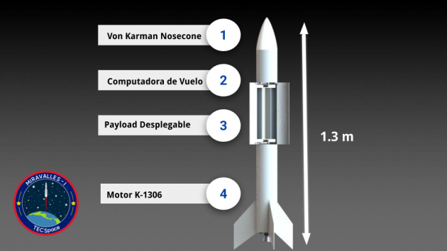
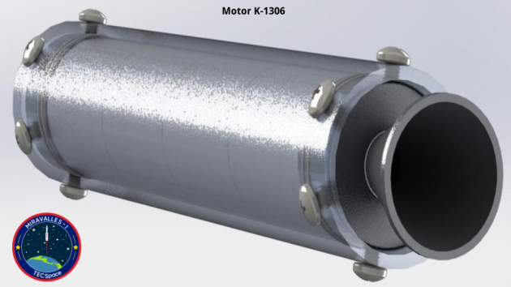
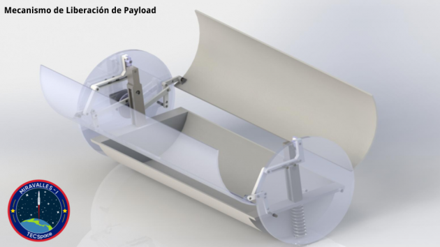
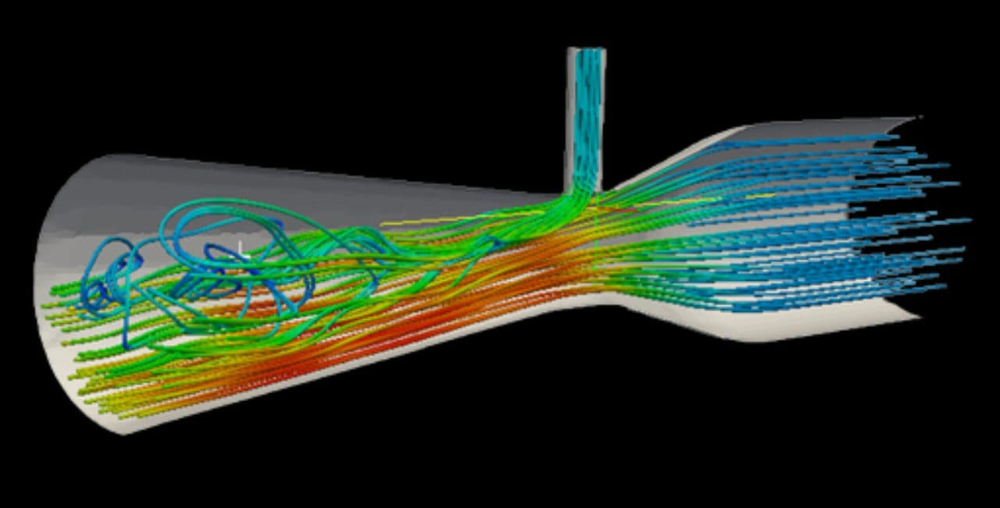
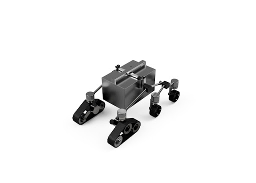
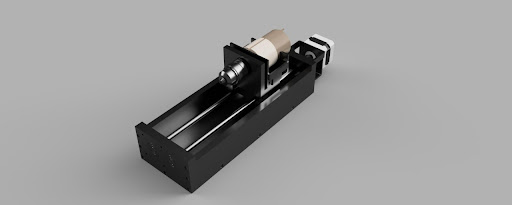
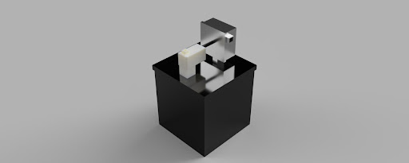

A continuación, se muestran todos los proyectos que actualmente se están desarrllando en TECSpace.

 
Estos se encuentran divididos de acuerdo a la sección a la cual pertenecen.

## Sección Cohetería

Los proyectos de esta sección se enfocan en cohetes y cualqueir tema de interés relacionado con los mismos.

 

    
Cohete Miravalles

     
    <ul><b>Información General del Proyecto:</b>
    

     <li>Miravalles - I, es el proyecto del desarrollo de un cohete capaz de lanzar CanSats y su infraestructura, pero su visión y objetivos van más allá de esto. Miravalles - I es el proyecto que permitirá a TECSpace y desde cierto punto de vista a Costa Rica, a empezar a emprender más activamente en el área de cohetería. Cabe resaltar que algunos proyectos de TECSpace se desarrollan gracias y por motivo del proyecto pinero de Miravalles I.</li>

    </ul>
    <ul><b>Habilidades Utilizadas:</b>
        <li>Utilización de un motor sólido K-1306.</li>
        <li>Implementación de una computador de vuelo.</li>
        <li>Vuelo desde una lanzadera.</li>
        <li>Uso de un banco de pruebas estáticas.</li>
        <li>Diseño del fuselaje.</li>
    </ul>
     
    <ul><b>Algunas Imágenes del Proyecto:</b>
    </ul>
    

     
    

     
    

     
    <a href="https://gogetfunding.com/help-tecspace-make-miravalles-i-mission-a-reality/">Hagamos del Miravalles I una REALIDAD:</a>
     

    
Librería de Diseño TREL

     
    <ul><b>Información General del Proyecto:</b>
    

     <li>Librería (library para programación) enfocada en facilitar el proceso de cálculos para diseñar motores de propelente sólido para cohetes, permitiendo así variaciones a parámetros que se ven reflejados en los resultados de rendimiento teórico para el motor, se puede encontrar el código fuente en <a href="https://github.com/Coheteria-TECSpace/TSEL">GitHub.</a></li>

    </ul>
    <ul><b>Habilidades Utilizadas:</b>
        <li>Programación en el lenguaje C (ANSI C99).</li>
        <li>Compilación de proyectos mediante CMake.</li>
    </ul>
    <ul><b>Ventajas a Destacar de esta Solución:</b>
        <li>Portabilidad de código a múltiples plataformas/dispositivos.</li>
        <li>Permite prevenir errores en cálculos a futuro en nuevas aplicaciones.</li>
    </ul>
     

    
Página Web TECSpace

     
    <ul><b>Información General del Proyecto:</b>
    

     <li>Página simple que permite mostrar información general sobre el grupo, e información sobre proyectos tanto de cohetería como de sistemas espaciales, se puede encontrar el código fuente en <a href="https://github.com/Coheteria-TECSpace/coheteria-tecspace github.io">GitHub.</a></li>

    </ul>
    <ul><b>Habilidades Utilizadas:</b>
        <li>Programación en lenguaje Markdown.</li>
        <li>Programación en lenguaje HTML.</li>
        <li>Colaboración por medio de Git.</li>
        <li>Manejo de repositorios de GitHub.</li>
    </ul>
     
    <ul><b>Algunas Imágenes del Proyecto:</b>
    </ul>
    

     

    
Plataforma Marina

     
    <ul><b>Objetivo del proyecto:</b>
     <li>Ejecutar lanzamientos de cohetes suborbitales en el país mediante una plataforma de despegue marina.</li>
    </ul>
    <ul><b>Justificación del proyecto:</b>
    
 
     <li>Se busca el aprovechamiento del potencial que presenta Costa Rica para los lanzamientos debido a que un 92% del territorio es marítimo, de este solo un 2.9% está protegido y se presentan 200 millas náuticas como zona económica exclusiva además de presentar una buena cercanía con el Ecuador.</li>

    </ul>
    <ul><b>Proyecto Multidisciplinario:</b>
     
     <li>Se desarrollarán distintas áreas como control eléctrico, ingeniería de materiales, diseño mecánico y modular.</li>
    </ul>
    <ul><b>Habilidades Desarrolladas:</b>
     
     <li>Diseño CAD.</li>
     <li>Consideración de procedimientos legales marítimos.</li>
     <li>Análisis de estabilidad y flotabilidad.</li>
     <li>Diseño electrónico.</li>
     <li>Resistencia de materiales.</li>
     <li>Resistencia de materiales.</li>
     <li>Mejora continua.</li>
    </ul>
     
    <ul><b>Algunas Imágenes del Proyecto:</b>
    </ul>
    

     
    

     

    
Cohete Multietapa

     
    <ul><b>Descripción del proyecto:</b>
    
 
     <li>La intención es construir un cohete multietapa de alcance medio, con una primera etapa subsónica y una segunda etapa transónica. Esto contempla varios desafíos de diseño mecánico, al igual que aerodinámico. La base de este proyecto es el cohete Miravalles-I.</li>

    </ul>
     
    <ul><b>Algunas Imágenes del Proyecto:</b>
    </ul>
    

     

    
Capacitación CFD

     
    <ul><b>Objetivo del proyecto:</b>
    
 
     <li>Capacitación continua de personal en tareas de simulación CFD (Computational Fluid Dynamics; Mecánica de Fluidos Computacional. Se trata de un proyecto dedicado a estudios previos requeridos para la ejecución de proyectos espaciales de TECSpace.</li>

    </ul>
    <ul><b>Habilidades Desarrolladas:</b>
     
     <li>Modelado en software 3D; Solidworks, Fusión 360.</li>
     <li>Manejo de software de simulación; Ansys, Comsol. </li>
     <li>Análisis y estudio de resultados obtenidos en simulaciones.</li>
    </ul>
     
    <ul><b>Algunas Imágenes del Proyecto:</b>
    </ul>
    

     

## Sistemas Espaciales

Sección enfocada a sistemas de interés general para exploración espacial, desarollo de proyectos que no necesariamente van relacionados con los cohetes.

 

    
Rover

     
    <ul><b>Información General del Proyecto:</b>
     <li>El proyecto Rover surgió debido al interés por desarrollar conocimientos sobre la robótica de exploración espacial. Se propone llevar a cabo una misión haciendo uso de la geología e ingeniería, la cual permita comprender el funcionamiento de sistemas electromecánicos, los cuales conforman un Rover, ante un ambiente hostil como el presente en los volcanes, para así eventualmente extrapolar el conocimiento adquirido en el diseño de una misión interplanetaria para explorar otros cuerpos celestes.</li>
    </ul>

    <ul><b>En qué consiste:</b>
     
     <li>La misión consiste en recolectar muestras de basalto-andesita y ceniza del cráter de un volcán cuando sea necesario independientemente de la actividad del mismo, además de monitorear la temperatura, niveles de CO2 y ácido sulfúrico para posteriormente transmitir los datos y facilitar las muestras de roca para que sean analizados por especialistas.</li>
    </ul>

    <ul><b>Objetivos:</b>
     
     <li>Este proyecto plantea cumplir con el objetivo de reducir riesgos a las personas que tomarían las muestras, permitir tener datos más accesibles y durante momentos de mucha actividad volcánica, además de simular ciertas dificultades que podría tener el Rover en otro planeta.</li>
    </ul>

    <ul><b>División de tareas:</b>
     
     <li>Para llevar a cabo el proyecto se dividió el trabajo en tres grandes grupos los cuales son: Sensores y Datos, Transporte de muestras y Recolección de Muestras. El primero se encarga de la implementación y el manejo de datos de los sensores, así como del control del Rover; el segundo es el grupo responsable de la estructura, protección y movilidad adecuada ante ambientes hostiles; y finalmente el tercer grupo es donde se diseñan las herramientas necesarias para la obtención y recolección de dichas muestras.</li>
    </ul>

    <ul><b>Progreso actual:</b>
     
     <li>El proyecto se encuentra en la fase del diseño preliminar del sistema, para eventualmente integrarlos y así obtener el primer prototipo del Rover. Este primer prototipo brindará una versión del Rover con características básicas definidas, que permitirá verificar y validar el diseño así como sus futuras mejoras.</li>
    </ul>

     
    <ul><b>Algunas Imágenes del Proyecto:</b>
    </ul>
    

     
    

     
    

     

     
    
Biodomo

    <ul><b>Misión del Proyecto:</b>
     <li>Creación de un prototipo funcional que aisle plantas del ambiente de manera que puedan crecer en condiciones óptimas.</li>
    </ul>
    <ul><b>Visión del Proyecto:</b>
     <li>Satisfacer la necesidad alimentaria de personas que se encuentran en ambientes desfavorables.</li>
    </ul>
    <ul><b>Objetivos del Proyecto:</b>
     <li>Ser una respuesta sostenible y rentable para la producción de cultis en micrclimas.</li>
     <li>Impulsar el desarrollo científico tecnlógico de nuestro país en el sectr aerespacial.</li>
    </ul>
     
    <ul><b>Algunas Imágenes del Proyecto:</b>
    </ul>
    

     
    

     
    
<video controls alt="Pagina Inicio" style="width:30rem;" align="middle">

    <source src="../images/Renders.mp4" type="video/mp4"/>

