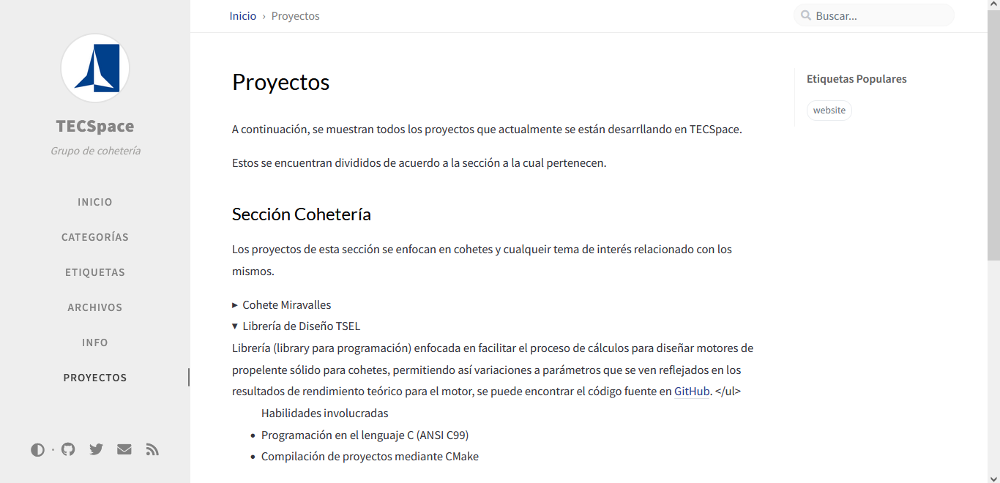
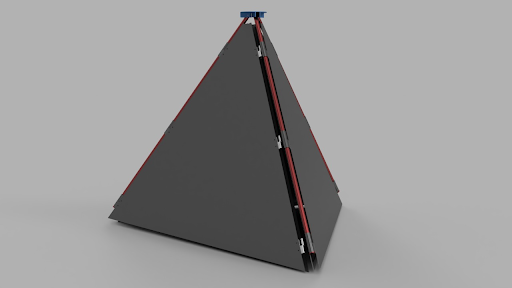
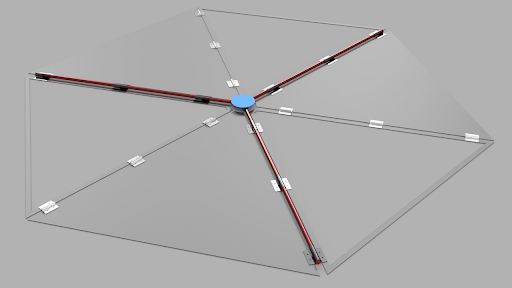
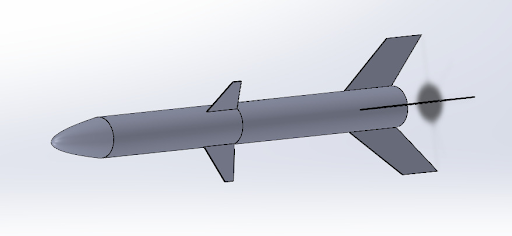

A continuación, se muestran todos los proyectos que actualmente se están desarrllando en TECSpace.

Estos se encuentran divididos de acuerdo a la sección a la cual pertenecen.

## Sección Cohetería
Los proyectos de esta sección se enfocan en cohetes y cualqueir tema de interés relacionado con los mismos.

    
Cohete Miravalles

    <a href="https://gogetfunding.com/help-tecspace-make-miravalles-i-mission-a-reality/">Hagamos del Miravalles I una REALIDAD</a>

    
Librería de Diseño TSEL

    Librería (library para programación) enfocada en facilitar el proceso de cálculos para diseñar motores de propelente sólido para cohetes, permitiendo así variaciones a parámetros que se ven reflejados en los resultados de rendimiento teórico para el motor, se puede encontrar el código fuente en <a href="https://github.com/Coheteria-TECSpace/TSEL">GitHub</a>.
    </ul>
    <ul><b>Habilidades Utilizadas:</b>
        <li>Programación en el lenguaje C (ANSI C99)</li>
        <li>Compilación de proyectos mediante CMake</li>
    </ul>
    <ul><b>Ventajas a Destacar de esta Solución:</b>
        <li>Portabilidad de código a múltiples plataformas/dispositivos</li>
        <li>Permite prevenir errores en cálculos a futuro en nuevas aplicaciones</li>
    </ul>

    
Página Web TECSpace

    Página simple que permite mostrar información general sobre el grupo, e información sobre proyectos tanto de cohetería como de sistemas espaciales, se puede encontrar el código fuente en <a href="https://github.com/Coheteria-TECSpace/coheteria-tecspace.github.io">GitHub</a>.
    
    <ul><b>Habilidades Utilizadas:</b>
        <li>Programación en lenguaje Markdown</li>
        <li>Programación en lenguaje HTML</li>
        <li>Colaboración por medio de Git</li>
        <li>Manejo de repositorios de GitHub</li>
    </ul>

    
Plataforma Marina

    <ul><b>Objetivo del proyecto:</b>
     
     <li>Ejecutar lanzamientos de cohetes suborbitales en el país mediante una plataforma de despegue marina.</li>
    </ul>
    <ul><b>Justificación del proyecto:</b>
     
     <li>Se busca el aprovechamiento del potencial que presenta Costa Rica para los lanzamientos debido a que un 92% del territorio es marítimo, de este solo un 2.9% está protegido y se presentan 200 millas náuticas como zona económica exclusiva además de presentar una buena cercanía con el Ecuador.</li>
    </ul>
    <ul><b>Proyecto Multidisciplinario:</b>
     
     <li>Se desarrollarán distintas áreas como control eléctrico, ingeniería de materiales, diseño mecánico y modular.</li>
    </ul>
    <ul><b>Habilidades Desarrolladas:</b>
     
     <li>Diseño CAD</li>
     <li>Consideración de procedimientos legales marítimos</li>
     <li>Análisis de estabilidad y flotabilidad</li>
     <li>Diseño electrónico</li>
     <li>Resistencia de materiales</li>
     <li>Resistencia de materiales</li>
     <li> Mejora continua</li>
    </ul>
     
    

    

     

    
Cohete Multietapa

    La intención es construir un cohete multietapa de alcance medio, con una primera etapa subsónica y una segunda etapa transónica. Esto contempla varios desafíos de diseño mecánico, al igual que aerodinámico. La base de este proyecto es el cohete Miravalles-I. 
     
    

     

## Sistemas Espaciales
Sección enfocada a sistemas de interés general para exploración espacial.

    
Rover

    Aún no se ha escrito esta información.

    
Biodomo

    Aún no se ha escrito esta información.

